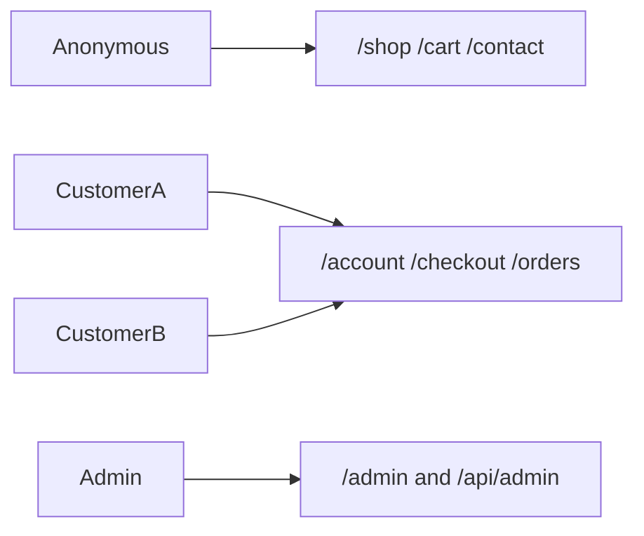

# OWASP Top 10:2025 — Defensive Checklist (RR Vastras)

Manual authorization and control verification for the RR Vastras storefront. This is **not** a penetration test. Each item describes a defensive action, the expected safe outcome, and the route or code it maps to. Record **Pass**, **Fail**, or **N/A** plus a one-line note.

**Target:** Local or staging only (`npm run dev` → http://localhost:3000). Do not run live production payments.

**Reference:** [OWASP Top 10:2025](https://owasp.org/Top10/2025/)

---

## Prerequisites

### Environment

1. Copy [`.env.example`](../.env.example) to `.env.local` and fill required values.
2. `npm install`
3. `npm run db:push` and `npm run db:seed`
4. `npm run dev`

Prefer **Cashfree sandbox** or **mock checkout** (leave `CASHFREE_APP_ID` / `CASHFREE_SECRET_KEY` unset for mock).

### Test personas

| Persona | Description |
| --- | --- |
| **Anonymous** | Signed out / incognito |
| **Customer A** | Normal Google shopper |
| **Customer B** | Second Google shopper (cross-user checks) |
| **Admin** | Google account matching `ADMIN_EMAIL` |

### Fixture data (before testing)

- At least one **published** product with stock.
- **Customer A:** saved address, at least one order (note order UUID for URL tests).
- **Customer B:** saved address, at least one order (note order UUID; do **not** share PII across accounts in notes).

### How to call APIs (optional)

Use browser DevTools → Network while using the app, or same-origin `fetch` from the console **while signed in** as the correct persona. Expect JSON responses with documented status codes only—no exploit payloads.

### Architecture (test surfaces)

**Note:** [`src/middleware.ts`](../src/middleware.ts) protects `/admin`, `/checkout`, and `/account` only. APIs and `/orders/[id]` use per-route checks.

---

## A01:2025 — Broken Access Control

**Code:** [`src/middleware.ts`](../src/middleware.ts), [`src/lib/session.ts`](../src/lib/session.ts), [`src/app/(storefront)/orders/[id]/page.tsx`](../src/app/(storefront)/orders/[id]/page.tsx), [`src/app/api/checkout/route.ts`](../src/app/api/checkout/route.ts), [`src/app/api/addresses/route.ts`](../src/app/api/addresses/route.ts), [`src/app/api/wishlist/route.ts`](../src/app/api/wishlist/route.ts), admin routes under `src/app/api/admin/`.

| ID | Surface | Persona | What to do | Expected result | Result / notes |
| --- | --- | --- | --- | --- | --- |
| A01-1 | `/admin` | Anonymous | Open URL in browser | Redirect to `/auth/signin` with `callbackUrl` | **Pass** — 307 → `/auth/signin?callbackUrl=%2Fadmin` (local, 2026-09-14) |
| A01-2 | `/checkout` | Anonymous | Open URL | Redirect to sign-in | **Pass** — 307 → sign-in with `callbackUrl=%2Fcheckout` |
| A01-3 | `/account` | Anonymous | Open URL | Redirect to sign-in | **Pass** — 307 → sign-in with `callbackUrl=%2Faccount` |
| A01-4 | `/admin`, `/admin/products`, `/admin/orders`, `/admin/settings` | Customer A | Open each URL | Redirect to `/` (not admin UI) | |
| A01-5 | `GET /api/admin/products` | Customer A | Request while signed in as A | **403** Forbidden | |
| A01-6 | `POST /api/admin/products` | Customer A | Request with minimal JSON body | **403** | |
| A01-7 | `GET /api/admin/settings` | Customer A | Request | **403** | |
| A01-8 | `POST /api/admin/upload` | Customer A | Request (no file or with file) | **403** | |
| A01-9 | `POST /api/admin/orders/{id}/ship` | Customer A | Use a valid order id from fixtures | **403** | |
| A01-10 | `GET /api/addresses` | Anonymous | Request | **401** Unauthorized | **Pass** — `{"error":"Unauthorized"}` |
| A01-11 | `GET /api/wishlist` | Anonymous | Request | **401** | **Pass** — `{"error":"Unauthorized"}` |
| A01-12 | `GET /api/addresses` | Customer A | Request | JSON list contains **only A’s** addresses (no B name/phone/pincode) | |
| A01-13 | `GET /api/wishlist` | Customer A | Request | Only A’s wishlist items | |
| A01-14 | `/orders/{B-order-id}` | Customer A | Open B’s order URL in browser | **404** page; must not show B shipping phone/address | |
| A01-15 | `POST /api/checkout` | Customer A | Body uses B’s `addressId` and valid items for A | **404** “Address not found” (address scoped by `userId`) | |
| A01-16 | `/admin/orders/{any-order-id}` | Admin | Open Customer A or B order | Order details visible; can mark shipped | |

---

## A02:2025 — Security Misconfiguration

**Code:** [`next.config.ts`](../next.config.ts), [`src/app/robots.ts`](../src/app/robots.ts), [`src/app/api/checkout/route.ts`](../src/app/api/checkout/route.ts) (mock path).

| ID | Surface | Persona | What to do | Expected result | Result / notes |
| --- | --- | --- | --- | --- | --- |
| A02-1 | Any HTML page (staging/prod) | Anonymous | Inspect response headers (DevTools → Network) | Document presence of CSP, `X-Content-Type-Options`, frame protection, Referrer-Policy, HSTS on HTTPS | |
| A02-2 | `POST /api/checkout` | Customer A | Send invalid JSON (e.g. empty body or non-JSON) | **400/500** with generic message; **no** stack trace, env vars, or Prisma internals in body | |
| A02-3 | Client bundles | Anonymous | Search page source / loaded JS for secret strings | No `AUTH_SECRET`, `DATABASE_URL`, Cashfree secret, Blob token | |
| A02-4 | `/robots.txt` | Anonymous | Open `/robots.txt` | Disallow includes `/admin/`, `/api/`, `/checkout`, `/account/` | |
| A02-5 | Checkout flow | Customer A | With Cashfree keys **set** in env, place order | Order does **not** auto-confirm via mock path (`isCashfreeConfigured()`) | |
| A02-6 | Checkout flow | Customer A | With Cashfree keys **unset**, place order | Mock confirm path allowed (dev only) | |
| A02-7 | Admin upload | Admin | On staging with `BLOB_READ_WRITE_TOKEN` set, upload image | Returns Blob HTTPS URL, not only base64 data URL | |

---

## A03:2025 — Software Supply Chain Failures

**Repo / config checks** (no attack tooling).

| ID | Surface | Persona | What to do | Expected result | Result / notes |
| --- | --- | --- | --- | --- | --- |
| A03-1 | Repository | Tester | Confirm `package-lock.json` is committed | Lockfile present; `npm ci` reproducible | |
| A03-2 | Repository | Tester | Run `npm audit` | Record high/critical findings for `next`, `next-auth`, `prisma`, `@vercel/blob` | |
| A03-3 | `package.json` | Tester | Search codebase for `zod` imports | `zod` listed but largely unused; API bodies mostly unschema-validated (design gap) | |
| A03-4 | [`next.config.ts`](../next.config.ts) | Tester | Review `images.remotePatterns` | Only allowlisted image hosts (Blob, Unsplash, placehold.co, Google avatars) | |
| A03-5 | [`src/lib/cashfree.ts`](../src/lib/cashfree.ts) | Tester | Review base URLs | Fixed Cashfree API hosts only; no user-controlled fetch URL | |

---

## A04:2025 — Cryptographic Failures

| ID | Surface | Persona | What to do | Expected result | Result / notes |
| --- | --- | --- | --- | --- | --- |
| A04-1 | Staging/production site | Anonymous | Confirm URL scheme | **HTTPS** only for public site | |
| A04-2 | Env config | Tester | Review `AUTH_URL`, `NEXT_PUBLIC_SITE_URL` on staging/prod | `https://` values | |
| A04-3 | Session cookie | Customer A | After sign-in, inspect session cookie flags (Application → Cookies) | `HttpOnly`; `Secure` on HTTPS prod; `SameSite` set (Auth.js defaults) | |
| A04-4 | Git | Tester | Confirm `.env*` ignored; `.env.example` has placeholders only | No real secrets in repo | |
| A04-5 | Checkout UI / DB | Customer A | Complete checkout | No card PAN stored; only Cashfree session/order identifiers | |
| A04-6 | `DATABASE_URL` | Tester | Review Neon connection string | TLS enabled (Neon default / `sslmode`) | |
| A04-7 | `AUTH_SECRET` | Tester | Confirm production secret | Long random value, not example placeholder | |

---

## A05:2025 — Injection

**Context:** Prisma ORM (no raw SQL in app). JSON-LD uses `dangerouslySetInnerHTML` with `JSON.stringify` of server-built objects on home/shop/PDP.

| ID | Surface | Persona | What to do | Expected result | Result / notes |
| --- | --- | --- | --- | --- | --- |
| A05-1 | Address form | Customer A | Save address with ordinary special characters in name/line1 (quotes, `<`, `>`, newlines) | Rendered as **plain text** on account/checkout; no HTML execution | |
| A05-2 | Admin product | Admin | Create/edit product name/description with same special characters | PDP and shop list show **text**, not markup | |
| A05-3 | Shop/home/PDP | Anonymous | View pages after A05-2 | JSON-LD `<script type="application/ld+json">` still valid (no broken page) | |
| A05-4 | Admin product slug | Admin | Submit slug with unusual characters | Normalized via `slugify` / unique slug check | |
| A05-5 | Contact / WhatsApp | Anonymous | Use contact page links | WhatsApp uses configured store number only, not user-supplied URLs | |

**Do not** use exploit payloads or automated fuzzers; ordinary reserved characters are sufficient.

---

## A06:2025 — Insecure Design

**Context:** Cart in [`src/lib/cart.ts`](../src/lib/cart.ts) (`localStorage` key `rrvastras-cart`). Checkout re-prices from DB in [`src/app/api/checkout/route.ts`](../src/app/api/checkout/route.ts). [`src/app/api/shipping/calculate/route.ts`](../src/app/api/shipping/calculate/route.ts) is display-only.

| ID | Surface | Persona | What to do | Expected result | Result / notes |
| --- | --- | --- | --- | --- | --- |
| A06-1 | Checkout | Customer A | Edit cart in DevTools (price/qty in `localStorage`), then checkout | Order total matches **DB** `priceInPaise`, not tampered cart | |
| A06-2 | `POST /api/checkout` | Customer A | Include unpublished product id or invalid product id | **400**; no order created | |
| A06-3 | `POST /api/checkout` | Customer A | Request quantity greater than stock | **400** out of stock | |
| A06-4 | Order record | Customer A | Compare shipping on confirmed order vs admin store settings | Matches `calculateShipping(subtotal, settings)`, not arbitrary client calculator input | |
| A06-5 | Payment | Customer A | Mock vs sandbox | Mock (no keys): immediate confirm; sandbox: **confirmed** only after provider success/webhook | |

---

## A07:2025 — Authentication Failures

**Code:** [`src/lib/auth.ts`](../src/lib/auth.ts), [`src/lib/auth.config.ts`](../src/lib/auth.config.ts), [`src/app/(storefront)/auth/signin/page.tsx`](../src/app/(storefront)/auth/signin/page.tsx).

| ID | Surface | Persona | What to do | Expected result | Result / notes |
| --- | --- | --- | --- | --- | --- |
| A07-1 | `/auth/signin` | Anonymous | Review sign-in UI | Google OAuth only; no password form | |
| A07-2 | First login | Admin email | Sign in with `ADMIN_EMAIL` Google account | User has admin role; `/admin` accessible | |
| A07-3 | First login | Other Google | Sign in with non-admin Google | `customer` role only | |
| A07-4 | Sign-in redirect | Anonymous | Sign in with `callbackUrl=/account` or `/checkout` | Lands on same-origin path after OAuth | |
| A07-5 | Open redirect | Anonymous | Attempt sign-in with external `callbackUrl` (full `https://` other site) | Must **not** redirect browser to external site after auth | |
| A07-6 | Sign out | Customer A | Sign out, visit `/account` | Redirect to sign-in again | |
| A07-7 | JWT role cache | Admin | While signed in, change user role in DB (e.g. Prisma Studio), refresh `/admin` without re-login | Document: admin UI should not persist if role revoked—or record gap if JWT still shows admin | |

---

## A08:2025 — Software or Data Integrity Failures

**Code:** [`src/app/api/webhooks/cashfree/route.ts`](../src/app/api/webhooks/cashfree/route.ts), [`src/app/api/admin/upload/route.ts`](../src/app/api/admin/upload/route.ts), [`src/components/admin/product-form.tsx`](../src/components/admin/product-form.tsx).

| ID | Surface | Persona | What to do | Expected result | Result / notes |
| --- | --- | --- | --- | --- | --- |
| A08-1 | Cashfree webhook | Tester | Review handler code / sandbox behavior | Pending order not confirmed without successful `verifyCashfreeOrder`; record **no webhook signature check** as control gap | |
| A08-2 | Mock orders | Tester | With Cashfree unset, complete checkout | `cashfreeOrderId` prefix `mock-` only in dev mock path | |
| A08-3 | `POST /api/admin/upload` | Admin | Upload non-image file (e.g. `.txt`) | Should reject or not serve as executable; note current lack of MIME/size limits | |
| A08-4 | Product images | Admin | Add product via form using file picker only | Image URLs come from `/api/admin/upload` response, not arbitrary remote URL field | |

---

## A09:2025 — Security Logging and Alerting Failures

| ID | Surface | Persona | What to do | Expected result | Result / notes |
| --- | --- | --- | --- | --- | --- |
| A09-1 | Webhook failure | Tester | Trigger webhook error (invalid body) in dev; read server log | Generic log line; no full payment payload / PII dump | |
| A09-2 | Admin access attempt | Customer A | Visit `/admin` (redirect to `/`) | No SIEM/alert today—record as **gap** | |
| A09-3 | Checkout payment init failure | Customer A | Force Cashfree failure (misconfigured keys on test env) | Client error must not expose secrets; note if provider raw error text returned | |
| A09-4 | Operations | Tester | Review monitoring | No in-app alerting product—record **not present** (N/A for pass/fail of feature) | |

---

## A10:2025 — Mishandling of Exceptional Conditions

| ID | Surface | Persona | What to do | Expected result | Result / notes |
| --- | --- | --- | --- | --- | --- |
| A10-1 | Cashfree create order | Customer A | Simulate create-order failure (invalid Cashfree creds) | Created DB order **rolled back** (deleted); client **500**; order not left `confirmed` | |
| A10-2 | Webhook unknown order | Tester | POST webhook body with unknown order id | **404** | |
| A10-3 | Webhook idempotency | Tester | Webhook for already-`confirmed` order | **200** `{ received: true }`; no double stock decrement | |
| A10-4 | Malformed JSON | Customer A / Anonymous | `POST /api/checkout` and `POST /api/shipping/calculate` with malformed body | **400/500**; app remains healthy | |
| A10-5 | Webhook logic | Tester | Review [`webhooks/cashfree`](../src/app/api/webhooks/cashfree/route.ts) | `order_status === "ACTIVE"` treated as paid—confirm sandbox semantics; record gap if ACTIVE ≠ paid | |
| A10-6 | Stock race | Two customers | Two sessions checkout last unit simultaneously (mock) | Document if both succeed or one fails | |

---

## Known control gaps (pre-review)

Use this list when interpreting **Fail** results or planning hardening. These are visible from current code; the checklist above may confirm them.

| Gap | Related OWASP | Location / note |
| --- | --- | --- |
| No security headers (CSP, HSTS, etc.) in Next config | A02 | [`next.config.ts`](../next.config.ts) — images only |
| API routes outside middleware matcher | A01 | [`src/middleware.ts`](../src/middleware.ts); `/orders/[id]` uses page-level check only |
| `zod` unused; minimal request validation | A03, A05, A06 | Admin/product, address, checkout JSON bodies |
| Cashfree webhook: no signature verification before processing | A08 | [`src/app/api/webhooks/cashfree/route.ts`](../src/app/api/webhooks/cashfree/route.ts) |
| Admin upload: no MIME allowlist or size cap | A08 | [`src/app/api/admin/upload/route.ts`](../src/app/api/admin/upload/route.ts) |
| JWT role cached until re-login | A07 | [`src/lib/auth.ts`](../src/lib/auth.ts) JWT callback |
| Checkout 500 may return `err.message` to client | A09, A10 | [`src/app/api/checkout/route.ts`](../src/app/api/checkout/route.ts) |
| No rate limiting / no security alerting | A09 | App-wide |
| Webhook treats `ACTIVE` as payment success | A10 | Cashfree webhook handler |

---

## Findings summary (fill after test run)

| Check ID | OWASP | Severity (self-assessed) | Summary | Recommended hardening |
| --- | --- | --- | --- | --- |
| | | | | |

**Test run metadata**

- **Date:**
- **Environment:** (local / staging URL)
- **Tester:**
- **Build / commit:**
- **Cashfree mode:** (mock / sandbox / N/A)

---

## Out of scope

- Exploit proof-of-concepts, fuzzing attack payloads, CSRF forgery recipes, webhook forgery how-tos
- Automated offensive scanners
- Code fixes as part of this checklist (track in Findings instead)
- Live production payment charges
